# PetOS API (.NET 8)

API RESTful para gerenciamento de **pets, vacinas, rotinas e alertas**, usando ASP.NET Core Web API com arquitetura em camadas, Entity Framework Core e Oracle.

---

## Integrantes

**Turma:** 2TDSPO

| Aluno | RM |
|---|---|
| Gustavo Gomes Martins | 555999 |
| Pedro dos Anjos | 563832 |
| Matheus de Mattos Vecchi | 561716 |
| Nicholas Albuquerque Buzo | 561082 |
| Nicholas Camillo Canadas de Paula | 561262 |

---

## Tecnologias

- .NET 8
- ASP.NET Core Web API
- Entity Framework Core
- Oracle Database (`Oracle.EntityFrameworkCore`)
- Swagger / OpenAPI

---

## Estrutura do projeto

```text
PetOS/
├── Controllers/
├── Services/
├── Repositories/
├── Models/
├── DTOs/
├── Data/
│   ├── AppDbContext.cs
├── Exceptions/
├── Mappings/
├── Migrations/
├── Program.cs
└── appsettings.json
```

### Estrutura dos Controllers

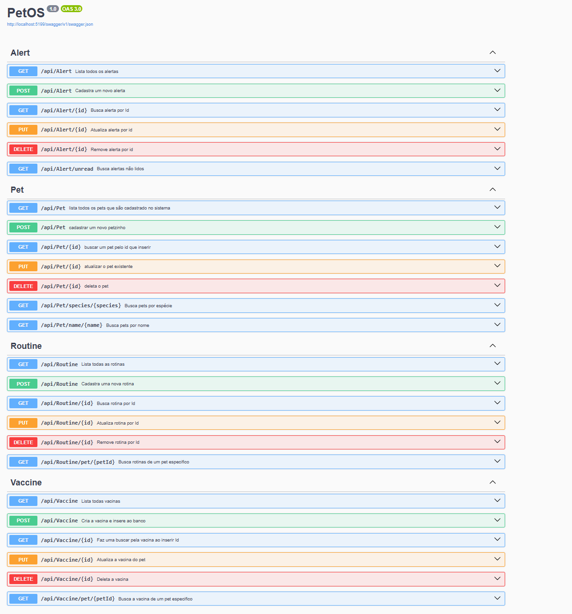

---

## Modelo de domínio

- `Pet` (1:N) `Vaccine`
- `Pet` (1:N) `Routine`
- `Pet` (1:N) `Alert`
- `Routine` (1:N) `Alert` (opcional)

---

## Endpoints principais

Base URL: `/api`

### Pet

- `GET /api/Pet`
- `GET /api/Pet/{id}`
- `GET /api/Pet/especie/{especie}`
- `GET /api/Pet/nome/{nome}`
- `POST /api/Pet`
- `PUT /api/Pet/{id}`
- `DELETE /api/Pet/{id}`

#### POST Pet

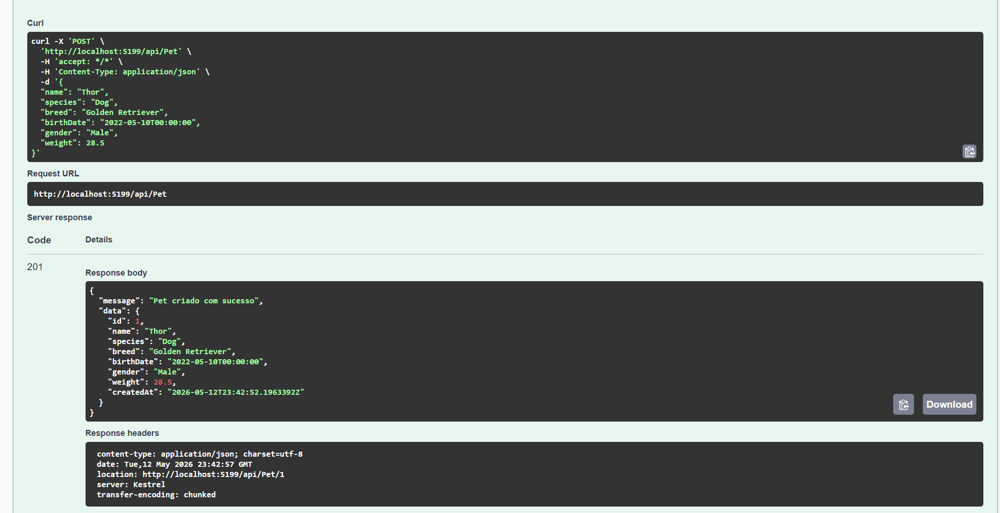

#### GET Pet por ID

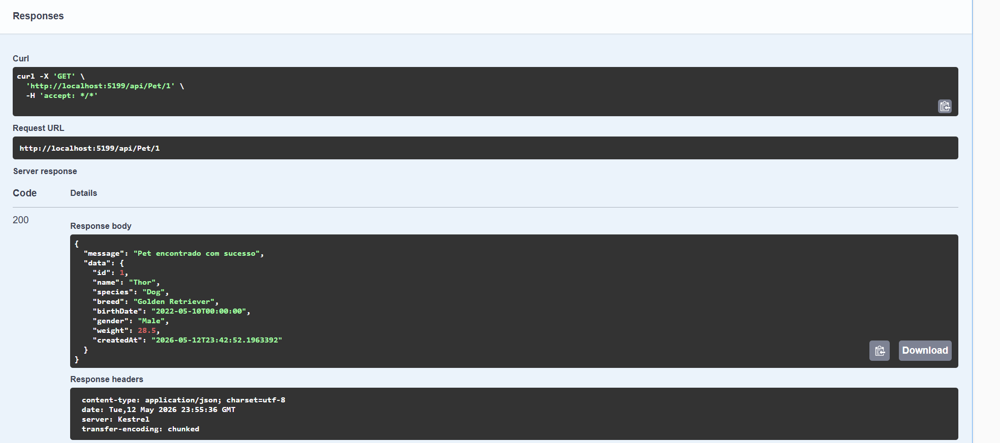

#### GET Pet por Espécie

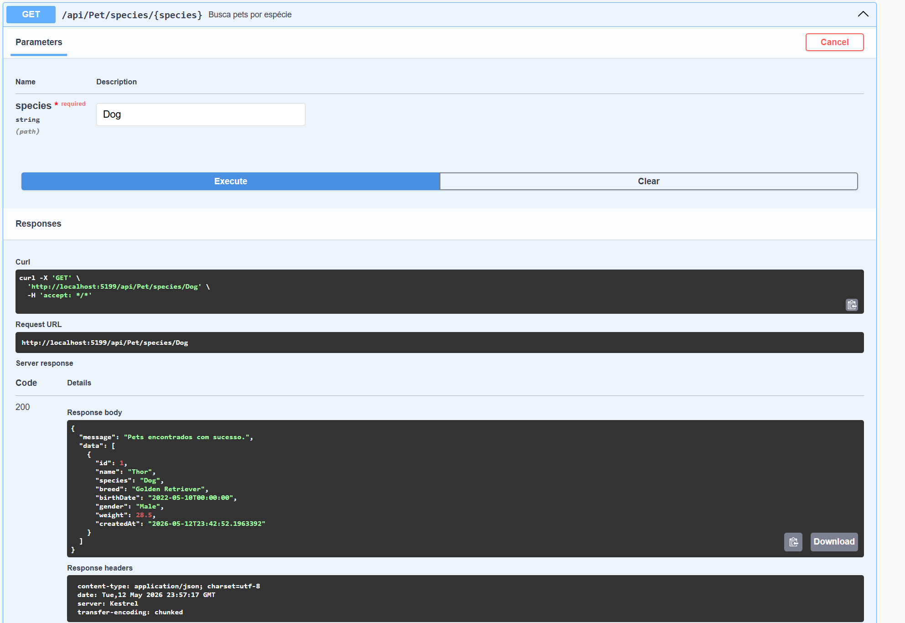

#### GET Pet por Nome

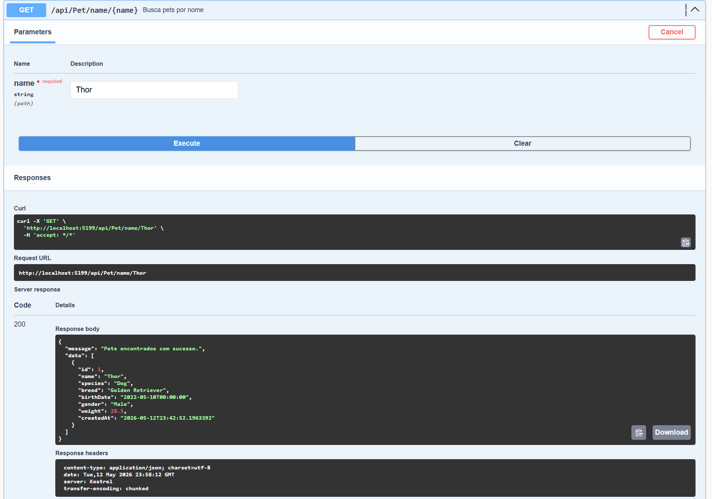

#### PUT Pet

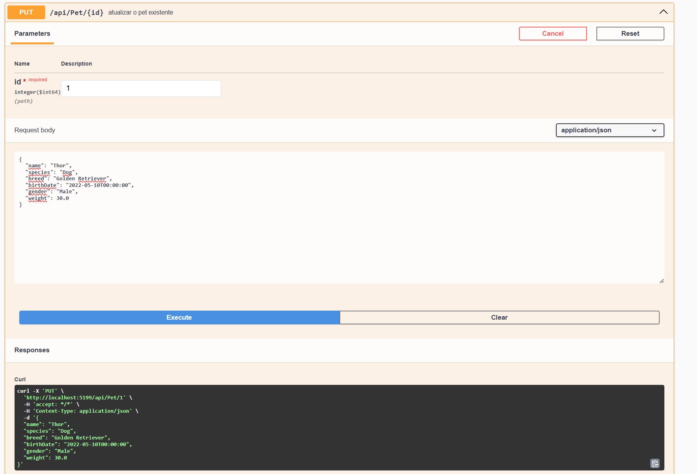

---

### Vaccine

- `GET /api/Vaccine`
- `GET /api/Vaccine/{id}`
- `POST /api/Vaccine`
- `DELETE /api/Vaccine/{id}`

#### POST Vaccine

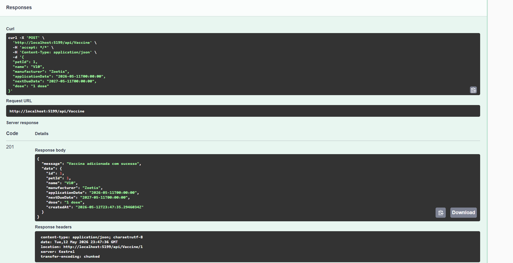

#### DELETE Vaccine

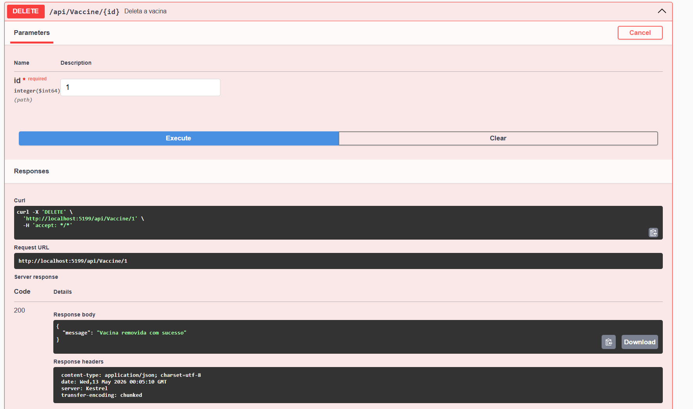

---

### Routine

- `GET /api/Routine`
- `GET /api/Routine/{id}`
- `POST /api/Routine`
- `DELETE /api/Routine/{id}`

#### POST Routine

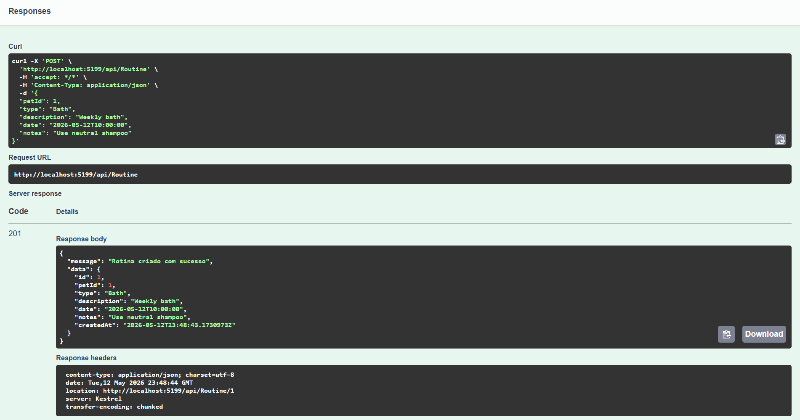

---

### Alert

- `GET /api/Alert`
- `GET /api/Alert/{id}`
- `GET /api/Alert/unread`
- `POST /api/Alert`
- `DELETE /api/Alert/{id}`

#### POST Alert

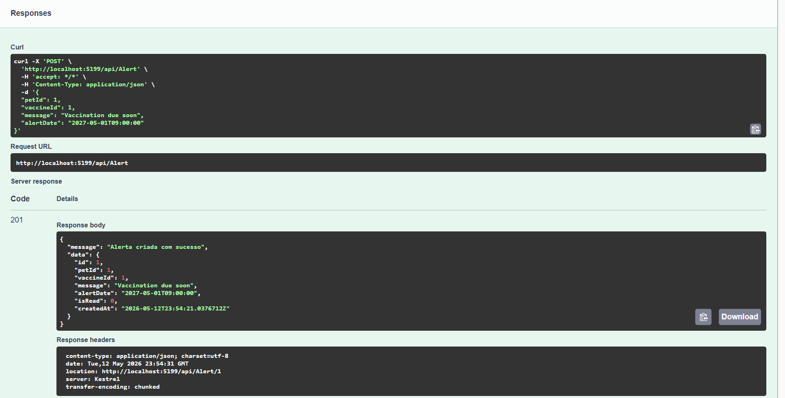

#### GET Alertas não lidos

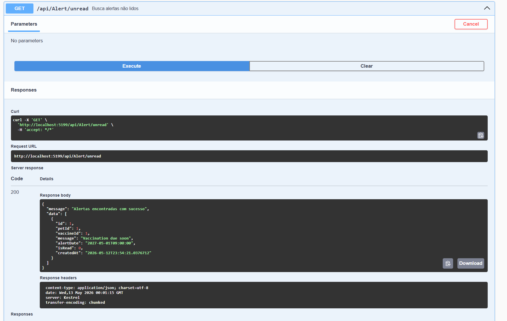

#### DELETE Alert

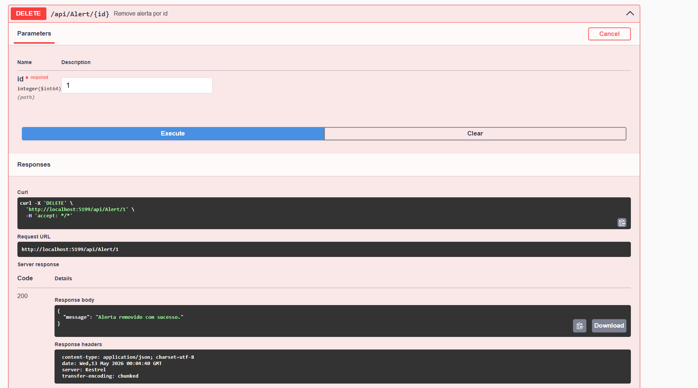

---

## Ordem correta para deletar registros

Para evitar erro de chave estrangeira, siga esta ordem:

### 1. Alert
Depende de: **Pet**, **Vaccine**
- `DELETE /api/Alert/{id}`

### 2. Vaccine
Depende de: **Pet**
- `DELETE /api/Vaccine/{id}`

### 3. Routine
Depende de: **Pet**
- `DELETE /api/Routine/{id}`

### 4. Pet
Por último.
- `DELETE /api/Pet/{id}`

---

## Retornos HTTP

| Código | Situação |
|---|---|
| `200 OK` | Consultas GET |
| `201 Created` | Criação de recursos (POST) |
| `204 No Content` | Atualização/remoção (PUT/DELETE) |
| `400 Bad Request` | Validações e referências inválidas |
| `404 Not Found` | Recursos inexistentes |

---

## Configuração do banco Oracle

A connection string está em:

- `PetOS/appsettings.json`
- `PetOS/appsettings.Development.json`

---

## Como executar

```git bash
cd \PetOS\PetOS
dotnet restore
dotnet build
dotnet ef database update
dotnet run
```

Swagger disponível em: `http://localhost:5199/swagger/index.html`
