# PetOS API (.NET 8)

API RESTful para gerenciamento de **pets, vacinas, rotinas e alertas**, usando ASP.NET Core Web API com arquitetura em camadas, Entity Framework Core e Oracle.

O projeto também conta com recursos de **monitoramento, observabilidade, logs estruturados, tracing distribuído, métricas e testes automatizados**.

---

## Integrantes

**Turma:** 2TDSPO

| Aluno | RM |
|---|---|
| Gustavo Gomes Martins | 555999 |
| Pedro dos Anjos | 563832 |
| Matheus de Mattos Vecchi | 561716 |
| Nicholas Albuquerque Buzo | 561082 |
| Nicholas Camillo Canadas de Paula | 561262 |

---

## Tecnologias

- .NET 8
- ASP.NET Core Web API
- Entity Framework Core
- Oracle Database (`Oracle.EntityFrameworkCore`)
- Swagger / OpenAPI
- Health Checks
- Serilog
- OpenTelemetry
- Prometheus Exporter
- xUnit
- Moq
- WebApplicationFactory
- Entity Framework Core InMemory

---

## Estrutura do projeto

```text
PetOS-dotnet/
├── PetOS/
│   ├── Controllers/
│   ├── Services/
│   ├── Repositories/
│   ├── Models/
│   ├── Dto/
│   ├── Data/
│   │   ├── AppDbContext.cs
│   │   └── Migrations/
│   ├── Middleware/
│   ├── Observability/
│   ├── HealthChecks/
│   ├── Properties/
│   ├── Program.cs
│   └── appsettings.json
│
├── Tests/
│   ├── PetOS.UnitTests/
│   │   ├── Services/
│   │   └── Domain/
│   │
│   └── PetOS.IntegrationTests/
│       ├── Controllers/
│       ├── HealthChecks/
│       └── Infrastructure/
│
├── PetOS.sln
└── README.md
```

### Estrutura dos Controllers

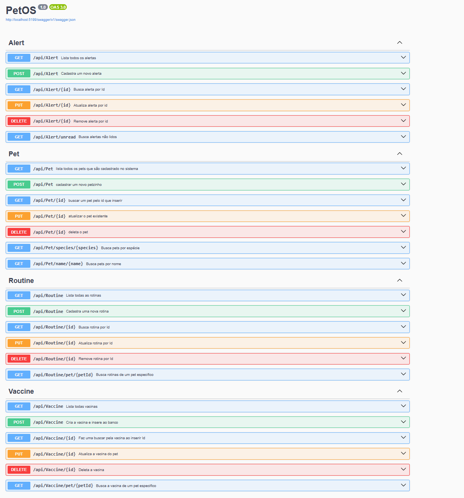

---

## Modelo de domínio

- `Pet` (1:N) `Vaccine`
- `Pet` (1:N) `Routine`
- `Pet` (1:N) `Alert`
- `Vaccine` (1:N) `Alert` (opcional)

Um alerta sempre pertence a um pet e pode, opcionalmente, estar associado a uma vacina.

A API também valida a integridade dessas relações. Por exemplo, não é permitido criar uma vacina ou rotina para um pet inexistente, nem associar um alerta a uma vacina pertencente a outro pet.

---

## Endpoints principais

Base URL: `/api`

### Pet

- `GET /api/Pet`
- `GET /api/Pet/{id}`
- `GET /api/Pet/species/{species}`
- `GET /api/Pet/name/{name}`
- `POST /api/Pet`
- `PUT /api/Pet/{id}`
- `DELETE /api/Pet/{id}`

#### POST Pet

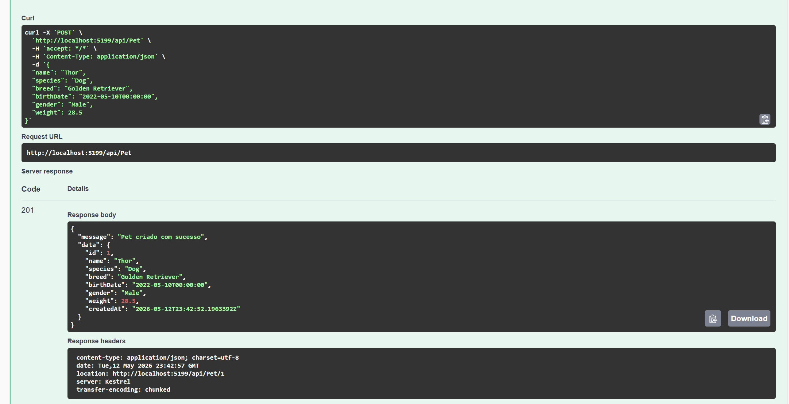

#### GET Pet por ID

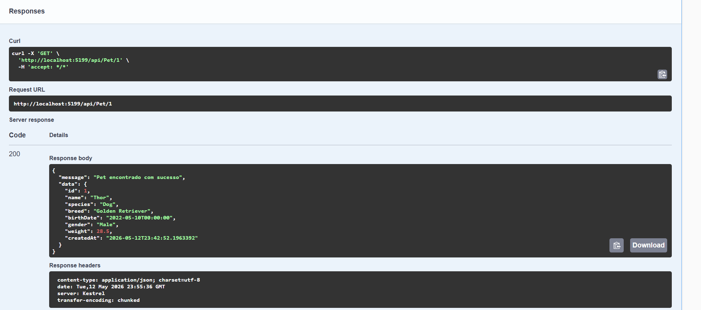

#### GET Pet por Espécie

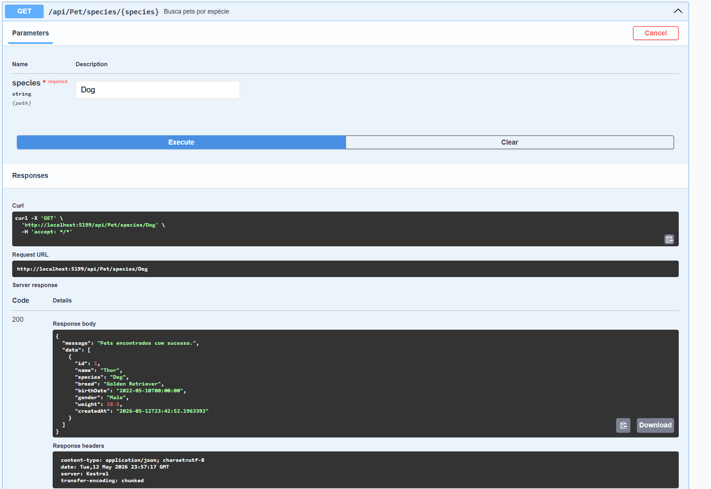

#### GET Pet por Nome

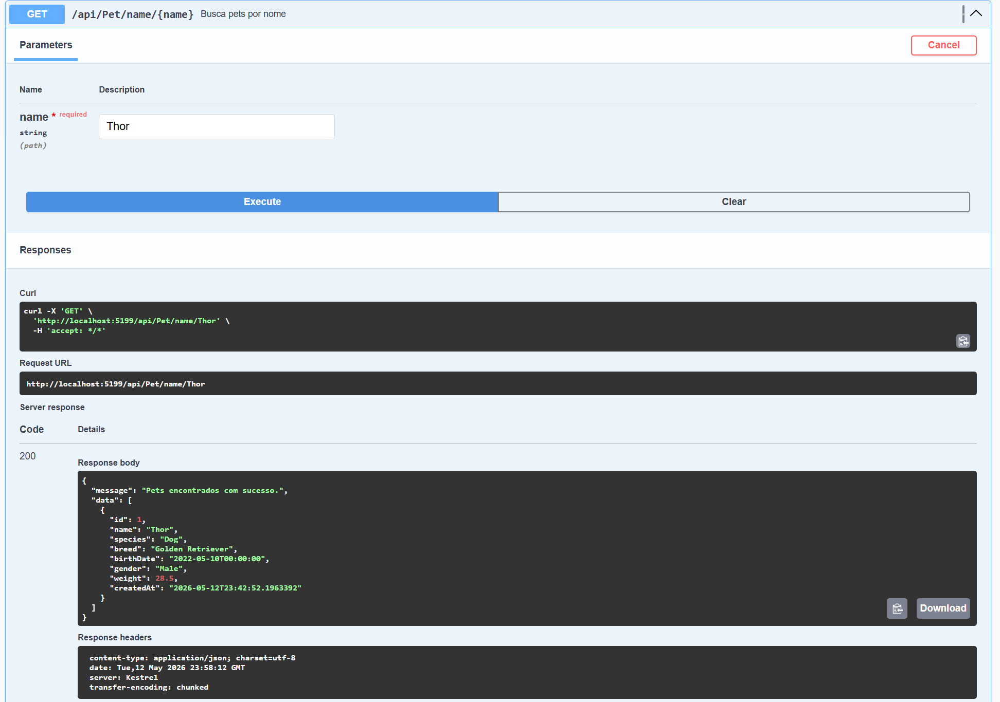

#### PUT Pet

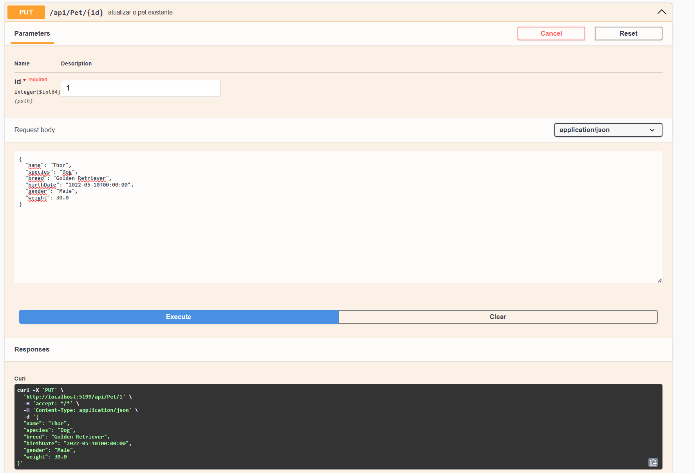

---

### Vaccine

- `GET /api/Vaccine`
- `GET /api/Vaccine/{id}`
- `GET /api/Vaccine/pet/{petId}`
- `POST /api/Vaccine`
- `PUT /api/Vaccine/{id}`
- `DELETE /api/Vaccine/{id}`

Ao cadastrar ou atualizar uma vacina, o `PetId` informado é validado.

No endpoint `GET /api/Vaccine/pet/{petId}`:

- Pet inexistente → `404 Not Found`
- Pet existente sem vacinas → `204 No Content`
- Pet existente com vacinas → `200 OK`

#### POST Vaccine

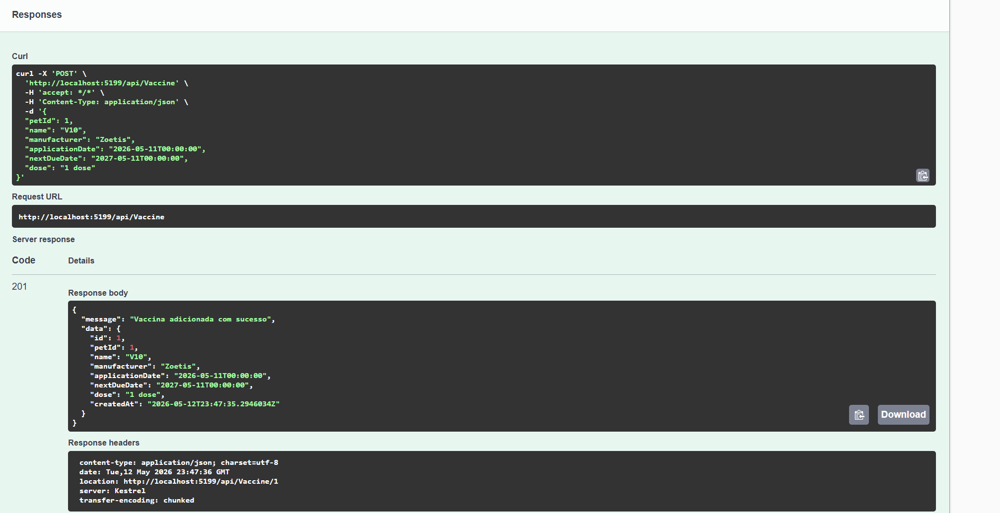

#### DELETE Vaccine

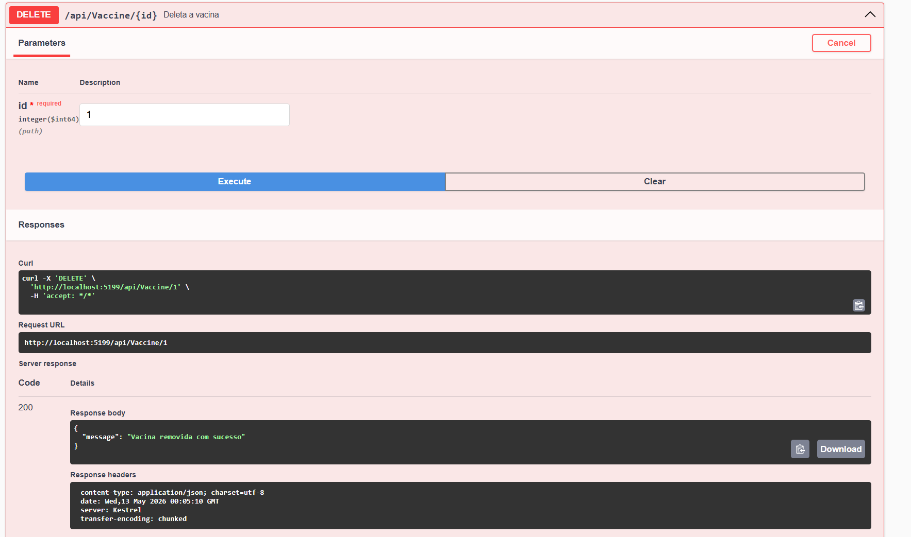

---

### Routine

- `GET /api/Routine`
- `GET /api/Routine/{id}`
- `GET /api/Routine/pet/{petId}`
- `POST /api/Routine`
- `PUT /api/Routine/{id}`
- `DELETE /api/Routine/{id}`

Ao cadastrar ou atualizar uma rotina, o `PetId` informado é validado.

No endpoint `GET /api/Routine/pet/{petId}`:

- Pet inexistente → `404 Not Found`
- Pet existente sem rotinas → `204 No Content`
- Pet existente com rotinas → `200 OK`

#### POST Routine

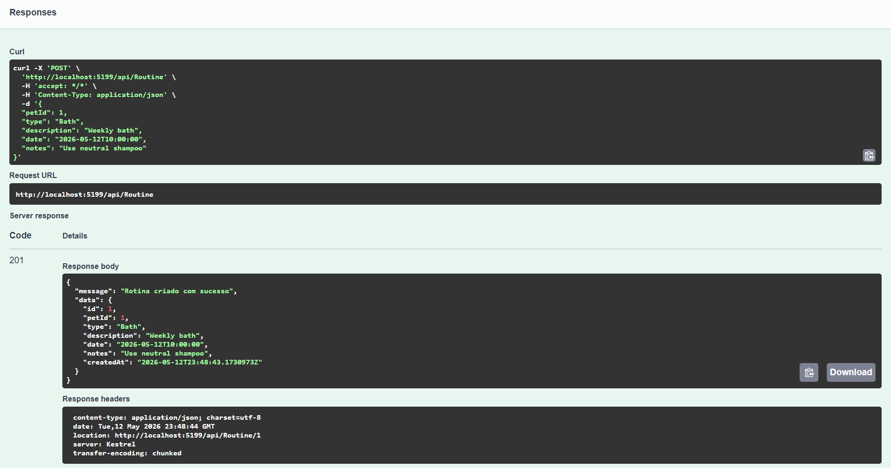

---

### Alert

- `GET /api/Alert`
- `GET /api/Alert/{id}`
- `GET /api/Alert/unread`
- `POST /api/Alert`
- `PUT /api/Alert/{id}`
- `DELETE /api/Alert/{id}`

Ao cadastrar ou atualizar um alerta:

- o `PetId` precisa pertencer a um pet existente;
- o `VaccineId`, quando informado, precisa pertencer a uma vacina existente;
- a vacina informada deve pertencer ao mesmo pet do alerta.

O `VaccineId` é opcional, permitindo alertas que não estejam relacionados a uma vacina.

#### POST Alert

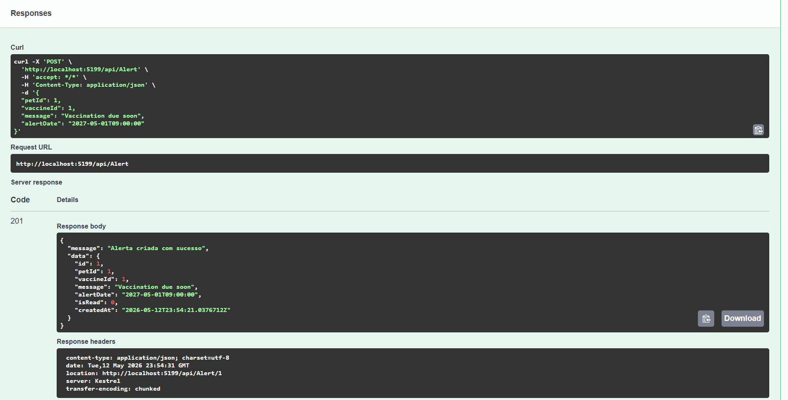

#### GET Alertas não lidos

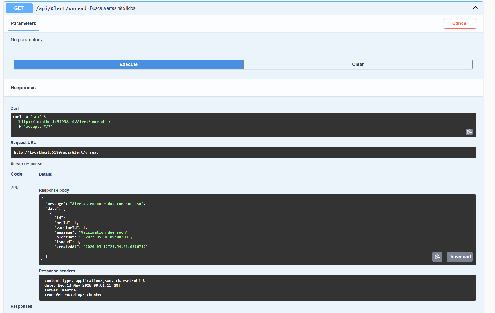

#### DELETE Alert

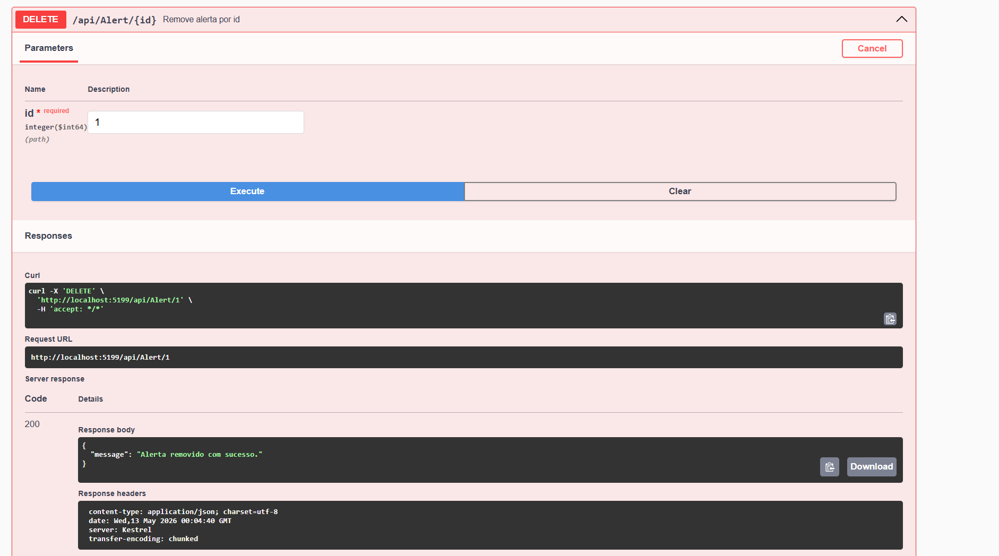

---

## Ordem correta para deletar registros

Para evitar erro de chave estrangeira, siga esta ordem:

### 1. Alert

Depende de: **Pet**, **Vaccine**

- `DELETE /api/Alert/{id}`

### 2. Vaccine

Depende de: **Pet**

- `DELETE /api/Vaccine/{id}`

### 3. Routine

Depende de: **Pet**

- `DELETE /api/Routine/{id}`

### 4. Pet

Por último.

- `DELETE /api/Pet/{id}`

---

## Retornos HTTP

| Código | Situação |
|---|---|
| `200 OK` | Consultas bem-sucedidas, atualizações e exclusões |
| `201 Created` | Criação de recursos (`POST`) |
| `204 No Content` | Consulta válida sem registros para retornar |
| `400 Bad Request` | Dados inválidos ou inconsistência entre relacionamentos |
| `404 Not Found` | Recurso ou referência informada não encontrada |
| `500 Internal Server Error` | Erro inesperado durante o processamento |

---

# Monitoramento e Observabilidade

A API utiliza recursos de monitoramento e observabilidade para acompanhar disponibilidade, requisições, erros e desempenho da aplicação.

---

## Health Checks

Foram configurados Health Checks para verificar a disponibilidade da API e a conexão com o banco de dados.

### Liveness

```http
GET /health/live
```

Verifica se a aplicação está em execução.

Resposta esperada:

```text
Healthy
```

### Readiness

```http
GET /health/ready
```

Verifica se a aplicação está pronta para receber requisições, incluindo a disponibilidade do `AppDbContext` e da conexão com Oracle.

Resposta esperada:

```text
Healthy
```

---

## Logs estruturados com Serilog

A aplicação utiliza **Serilog** para geração de logs estruturados.

Os logs são enviados para:

- Console
- Arquivos locais na pasta `logs/`

Os principais níveis utilizados são:

- `Information` para requisições processadas normalmente;
- `Warning` para respostas HTTP `4xx`;
- `Error` para respostas `5xx` ou exceções.

Exemplo:

```text
[INF] [CorrelationId:...] HTTP GET /api/Pet responded 200
[WRN] [CorrelationId:...] HTTP GET /api/Pet/999 responded 404
```

---

## Correlation ID

Cada requisição recebe um identificador de correlação através do header:

```text
X-Correlation-ID
```

Caso o cliente não envie um identificador, a aplicação gera automaticamente um novo valor.

O mesmo `CorrelationId` é incluído nos logs relacionados à requisição, facilitando o rastreamento de uma operação do início ao fim.

---

## Tracing com OpenTelemetry

A API utiliza **OpenTelemetry** para tracing das requisições.

O tracing acompanha a passagem da requisição pelas principais camadas:

```text
HTTP Request
     ↓
Controller
     ↓
Service
     ↓
Repository
     ↓
Database
```

Os módulos instrumentados incluem:

- Pet
- Vaccine
- Routine
- Alert

Exemplo de fluxo:

```text
GET /api/Pet/1
└── PetService.GetByIdAsync
    └── PetRepository.GetByIdAsync
```

Os spans de uma mesma operação compartilham o mesmo `TraceId`, permitindo acompanhar o fluxo completo da requisição.

Também são adicionadas tags aos spans quando aplicável, como:

```text
pet.id
vaccine.id
routine.id
alert.id
pet.species
```

---

## Métricas

As métricas da aplicação são disponibilizadas pelo OpenTelemetry através do exporter compatível com Prometheus.

Endpoint:

```http
GET /metrics
```

Entre as métricas disponibilizadas estão informações sobre:

- quantidade de requisições;
- status HTTP;
- duração das requisições;
- tempo total de processamento;
- distribuição do tempo de resposta.

Exemplo de métrica:

```text
http_server_request_duration_seconds_count
http_server_request_duration_seconds_sum
http_server_request_duration_seconds_bucket
```

Essas informações permitem calcular indicadores como tempo médio de resposta e taxa de erros da API.

---

# Testes Automatizados

O projeto utiliza **xUnit** para testes automatizados, seguindo o padrão **AAA (Arrange, Act, Assert)**.

Os testes estão separados em projetos distintos:

```text
Tests/
├── PetOS.UnitTests/
└── PetOS.IntegrationTests/
```

---

## Testes Unitários

Os testes unitários validam as regras e comportamentos das camadas de domínio e aplicação.

São utilizados:

- xUnit
- Moq
- AAA (Arrange, Act, Assert)

Os Services possuem testes utilizando mocks dos Repositories, evitando dependência do Oracle durante a execução dos testes.

Exemplo conceitual:

```text
PetService
    ↓
Mock<IPetRepository>
```

São testados cenários relacionados a:

- PetService
- VaccineService
- RoutineService
- AlertService
- validações dos Models;
- criação de recursos;
- consultas;
- atualizações;
- recursos inexistentes;
- regras de negócio.

---

## Testes de domínio

As validações presentes nos Models são testadas através das `DataAnnotations`.

São verificadas regras como:

```text
Required
StringLength
Range
```

Os testes abrangem:

```text
Pet
Vaccine
RoutineRecord
Alert
```

---

## Testes de integração

Os testes de integração utilizam:

- `WebApplicationFactory`
- `HttpClient`
- Entity Framework Core InMemory
- Fixtures
- Collection Fixtures

Durante os testes de integração, o Oracle é substituído por um banco em memória.

Fluxo testado:

```text
HttpClient
    ↓
ASP.NET Core
    ↓
Controller
    ↓
Service
    ↓
Repository
    ↓
EF Core InMemory
```

São testados fluxos HTTP de sucesso e erro para:

- Pet
- Vaccine
- Routine
- Alert
- Health Checks

Também são verificadas regras como:

```text
Pet inexistente → 404
Vacina inexistente → 404
Vacina pertencente a outro pet → 400
Recurso encontrado → 200
Recurso criado → 201
```

---

## Fixtures e Collection Fixtures

Os testes de integração utilizam `PetOsWebApplicationFactory` para inicializar a aplicação durante os testes.

A infraestrutura é compartilhada através de:

```csharp
ICollectionFixture<PetOsWebApplicationFactory>
```

e da collection:

```text
PetOS Integration Collection
```

Isso permite reutilizar a infraestrutura entre diferentes classes de testes de integração.

---

## Executando os testes

Para executar toda a suíte:

```bash
dotnet test
```

Para executar somente os testes unitários:

```bash
dotnet test Tests/PetOS.UnitTests/PetOS.UnitTests.csproj
```

Para executar somente os testes de integração:

```bash
dotnet test Tests/PetOS.IntegrationTests/PetOS.IntegrationTests.csproj
```

---

## Configuração do banco Oracle

A aplicação utiliza a chave de configuração:

```text
ConnectionStrings:Oracle
```

A connection string pode ser configurada em:

- `PetOS/appsettings.json`
- `PetOS/appsettings.Development.json`
- variáveis de ambiente
- .NET User Secrets

> Não versione usuário, senha ou outras credenciais reais do Oracle no repositório.

---

## Como executar

A partir da raiz do repositório:

```bash
dotnet restore
dotnet build
dotnet ef database update --project PetOS/PetOS.csproj
dotnet run --project PetOS/PetOS.csproj
```

Swagger disponível em:

```text
http://localhost:5199/swagger/index.html
```

Health Checks:

```text
http://localhost:5199/health/live
http://localhost:5199/health/ready
```

Métricas:

```text
http://localhost:5199/metrics
```